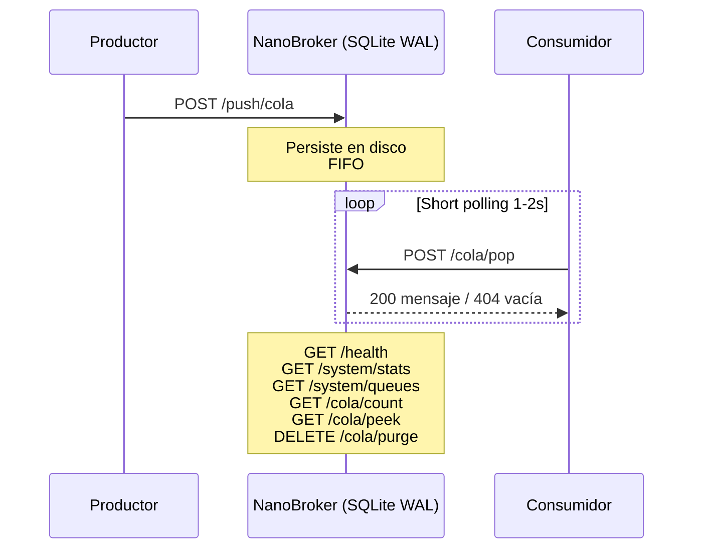

# NanoBroker

Broker de mensajería universal vía HTTP. Colas FIFO persistentes en SQLite con modo WAL. Consumo mínimo de recursos (~30 MB RAM).

---

## Índice

- [Arquitectura](#arquitectura)
- [Formato del mensaje](#formato-del-mensaje)
- [TTL (Time To Live)](#ttl-time-to-live)
- [Endpoints](#endpoints)
  - [Push — Insertar mensaje](#push--insertar-mensaje)
  - [Pop — Consumir mensaje](#pop--consumir-mensaje)
  - [Pop con patrón — Wildcard](#pop-con-patrón-wildcard)
  - [Peek — Inspeccionar sin consumir](#peek--inspeccionar-sin-consumir)
  - [Count — Contar mensajes](#count--contar-mensajes)
  - [Purge — Vaciar cola](#purge--vaciar-cola)
  - [Stats — Backlog global](#stats--backlog-global)
  - [Queues — Listar colas activas](#queues--listar-colas-activas)
  - [Health — Estado del servicio](#health--estado-del-servicio)
- [Consumidor (short polling)](#consumidor-short-polling)
- [Configuración](#configuración)
- [Despliegue con Docker](#despliegue-con-docker)
- [Tests](#tests)
- [Ejemplos de uso](#ejemplos-de-uso)

---

## Arquitectura



- Las colas se crean automáticamente al recibir el primer mensaje.
- Los nombres de cola aceptan cualquier string, incluyendo notación de puntos: `pagos.verificar`, `logs.error`, `sensores.temperatura`.
- Todos los mensajes se persisten en disco. No se pierden aunque el servicio se reinicie.

---

## Formato del mensaje

```json
{
  "event_id": "id-unico-123",
  "event_type": "tu.tipo.evento",
  "timestamp": "2026-07-04T12:00:00Z",
  "payload": { "cualquier": "dato" }
}
```

| Campo | Tipo | Descripción |
|-------|------|-------------|
| `event_id` | string | Identificador único del mensaje (lo pones tú) |
| `event_type` | string | Etiqueta semántica para el consumidor |
| `timestamp` | string | ISO-8601 de creación del mensaje |
| `payload` | object | **Los datos de negocio**. El broker no lo inspecciona |

El broker nunca valida ni interpreta el `payload`. Solo lo almacena y lo devuelve tal cual en el pop.

---

## TTL (Time To Live)

El TTL se especifica como **query param** en el push (en segundos desde el momento actual). El broker descarta silenciosamente los mensajes expirados al momento del pop.

**Ejemplo — mensaje que expira en 5 minutos:**

```bash
curl -X POST "http://localhost:8000/api/v1/push/mi_cola?ttl=300" \
  -H "Content-Type: application/json" \
  -d '{
    "event_id": "codigo-001",
    "event_type": "verificacion.email",
    "timestamp": "2026-07-04T12:00:00Z",
    "payload": {"codigo": "847291"}
  }'
```

Casos de uso reales:

| Situación | TTL | Por qué |
|-----------|-----|---------|
| Código de verificación por email | 5 min | No enviar códigos vencidos |
| Lectura de sensor IoT | 30 s | Las lecturas viejas no sirven |
| Oferta flash / promo | 1 h | Pasó el tiempo, no notificar |
| Comando de dispositivo | 10 s | "Abrir puerta" no debe ejecutarse tarde |
| Notificación de estado | 2 min | El estado ya cambió |

Si **todos** los mensajes de una cola tienen el TTL expirado, el pop responde `404` como si la cola estuviera vacía. Los mensajes expirados se eliminan periódicamente por el janitor interno.

---

## Endpoints

### Push — Insertar mensaje

```
POST /api/v1/push/{queue_name}
```

Crea la cola si no existe. Responde `201`.

```json
// Request
{
  "event_id": "orden-001",
  "event_type": "order.created",
  "timestamp": "2026-07-04T12:00:00Z",
  "payload": { "total": 150.00 }
}

// Response 201
{ "status": "ACK", "queue": "ordenes.nuevas", "event_id": "orden-001" }
```

### Pop — Consumir mensaje

```
POST /api/v1/queue/{queue_name}/pop
```

Consume el mensaje más antiguo de la cola de forma **no destructiva**. El mensaje queda invisible durante `visibility_timeout` segundos (default 30). El consumidor debe enviar un `ack` explícito para eliminarlo, o un `nack` para reintentarlo.

```json
// Response 200
{
  "id": 1,
  "event_id": "orden-001",
  "event_type": "order.created",
  "timestamp": "2026-07-04T12:00:00Z",
  "payload": { "total": 150.00 },
  "retry_count": 1,
  "max_retries": 5
}

// Response 404 (cola vacía)
{ "detail": "Queue Empty" }
```

Opera bajo semántica **At-Least-Once**: si dos consumidores intentan popear simultáneamente, SQLite serializa las transacciones y el mensaje se entrega a uno solo. Sin embargo, el mensaje no se elimina hasta que el consumidor envía un `ack` explícito. Si el consumidor muere después de procesar el mensaje pero antes de ackearlo, el mensaje reaparecerá tras el `visibility_timeout`.  
**Los consumidores deben ser idempotentes** para tolerar posibles re-entrega de mensajes.

### Pop con patrón — Wildcard

```
POST /api/v1/queue/pop/like?pattern={patron}
```

Consume el mensaje más antiguo de **cualquier cola** que coincida con el patrón SQL `LIKE`.

```bash
# Todas las que empiecen con "ordenes."
POST /api/v1/queue/pop/like?pattern=ordenes.%

# Todas las que terminen con ".error"
POST /api/v1/queue/pop/like?pattern=%.error

# Todas las colas del sistema
POST /api/v1/queue/pop/like?pattern=%
```

```json
// Response 200 (incluye queue_name)
{
  "queue_name": "ordenes.nuevas",
  "event_id": "orden-001",
  "event_type": "order.created",
  "timestamp": "2026-07-04T12:00:00Z",
  "payload": { "total": 150.00 }
}
```

Los patrones con prefijo fijo (ej: `ordenes.%`) usan el índice de la base de datos y son eficientes aunque haya millones de mensajes.

### Peek — Inspeccionar sin consumir

```
GET /api/v1/queue/{queue_name}/peek
GET /api/v1/queue/{queue_name}/peek?limit=10
```

Devuelve los mensajes más antiguos **sin eliminarlos**. Ideal para monitoreo y debugging.

- Sin `limit` (o `limit=1`): devuelve un solo objeto mensaje.
- Con `limit > 1`: devuelve un array de mensajes.

```json
// GET /api/v1/queue/ordenes.nuevas/peek
// Response 200
{
  "event_id": "orden-001",
  "event_type": "order.created",
  "timestamp": "2026-07-04T12:00:00Z",
  "payload": { "total": 150.00 }
}

// GET /api/v1/queue/ordenes.nuevas/peek?limit=3
// Response 200
{
  "messages": [
    { "event_id": "orden-001", "event_type": "order.created", ... },
    { "event_id": "orden-002", "event_type": "order.created", ... },
    { "event_id": "orden-003", "event_type": "order.created", ... }
  ],
  "count": 3
}

// Response 404 (cola vacía)
{ "detail": "Queue Empty" }
```

### Count — Contar mensajes

```
GET /api/v1/queue/{queue_name}/count
```

```json
// Response 200
{ "queue": "ordenes.nuevas", "count": 42 }
```

### Purge — Vaciar cola

```
DELETE /api/v1/system/queue/{queue_name}/purge
```

Elimina **todos** los mensajes de una cola. Operación irreversible.

```json
// Response 200
{ "status": "PURGED", "queue": "ordenes.nuevas", "deleted": 42 }
```

### Stats — Backlog global

```
GET /api/v1/system/stats
```

```json
{
  "engine_status": "ONLINE",
  "storage_mode": "WAL",
  "metrics": {
    "total_backlog": 150,
    "queues": {
      "ordenes.nuevas": 100,
      "ordenes.error": 50
    }
  }
}
```

### Queues — Listar colas activas

```
GET /api/v1/system/queues
```

Devuelve solo las colas que tienen al menos un mensaje.

```json
{
  "queues": [
    { "name": "ordenes.error", "pending": 50 },
    { "name": "ordenes.nuevas", "pending": 100 }
  ]
}
```

### Health — Estado del servicio

```
GET /health
```

Ejecuta `PRAGMA quick_check` sobre SQLite para verificar integridad de la base de datos. Además expone el contador de mensajes procesados desde el inicio del proceso.

```json
{
  "status": "ok",
  "db_integrity": "ok",
  "processed_total": 1280
}
```

En caso de corrupción de la base de datos:

```json
{
  "status": "degraded",
  "db_integrity": "*** in database main ***\n  On page 101 at row 5: NULL value in column payload",
  "processed_total": 42
}
```

---

## Consumidor (short polling)

El broker es pasivo (solo pull). El consumidor debe implementar un bucle de pop → process → ack:

```python
import time
import requests

BROKER = "http://localhost:8000"
QUEUE = "ordenes.nuevas"

while True:
    r = requests.post(f"{BROKER}/api/v1/queue/{QUEUE}/pop")
    if r.status_code == 200:
        msg = r.json()
        try:
            # Lógica de negocio aquí
            print(f"Procesando: {msg['event_id']}")
            # Confirmar procesamiento exitoso
            requests.post(f"{BROKER}/api/v1/message/{msg['id']}/ack")
        except Exception:
            # Rechazar para reintento (se mueve a failed_* si agotó reintentos)
            requests.post(f"{BROKER}/api/v1/message/{msg['id']}/nack")
    else:
        time.sleep(1)  # Esperar antes de reintentar
```

Los consumidores **deben ser idempotentes**: un mensaje puede entregarse más de una vez si el consumidor muere antes de ackear.

O usando wildcard para consumir de múltiples colas:

```python
while True:
    r = requests.post(f"{BROKER}/api/v1/queue/pop/like?pattern=ordenes.%")
    if r.status_code == 200:
        msg = r.json()
        print(f"De cola {msg['queue_name']}: {msg['event_id']}")
        # process + ack/nack aquí
    else:
        time.sleep(1)
```

---

## Configuración

| Variable | Default | Descripción |
|---|---|---|
| `NANOBROKER_DB_FILE` | `broker_local.db` | Ruta al archivo SQLite |
| `NANOBROKER_HOST` | `0.0.0.0` | Dirección de red |
| `NANOBROKER_PORT` | `8000` | Puerto HTTP |
| `NANOBROKER_LOG_LEVEL` | `INFO` | DEBUG, INFO, WARNING, ERROR |
| `NANOBROKER_DB_TIMEOUT` | `1` | Timeout de SQLite en segundos |
| `NANOBROKER_JANITOR_INTERVAL_SEC` | `30` | Intervalo del janitor (limpieza de expirados y checkpoint WAL) |

---

## Despliegue con Docker

```bash
docker compose up -d
```

El archivo `docker-compose.yml` incluye healthcheck automático y un volumen persistente para la base de datos.

---

## Tests

```bash
pip install pytest
python -m pytest test_main.py -v
```

21 tests que cubren: push, pop, FIFO, wildcards, peek, count, purge, stats, listado de colas, TTL, contador de procesados, esquemas inválidos.

---

## Ejemplos de uso

### Productor genérico (cualquier lenguaje HTTP)

```bash
curl -X POST http://localhost:8000/api/v1/push/mi_cola \
  -H "Content-Type: application/json" \
  -d '{
    "event_id": "msg-001",
    "event_type": "mi.evento",
    "timestamp": "2026-07-04T12:00:00Z",
    "payload": {"dato": "valor"}
  }'
```

### Consumidor genérico

```bash
# Consumir un mensaje
curl -X POST http://localhost:8000/api/v1/queue/mi_cola/pop

# Ver el primero sin consumirlo
curl http://localhost:8000/api/v1/queue/mi_cola/peek

# Cuántos mensajes hay
curl http://localhost:8000/api/v1/queue/mi_cola/count
```

### Mensaje con TTL

```python
import time, requests

msg = {
    "event_id": "sensor-01",
    "event_type": "iot.temp",
    "timestamp": "2026-07-04T12:00:00Z",
    "payload": {
        "sensor": "tanque-3",
        "temp": 88.5,
        "_ttl": time.time() + 30  # expira en 30 segundos
    }
}
requests.post("http://localhost:8000/api/v1/push/sensores", json=msg)
```
